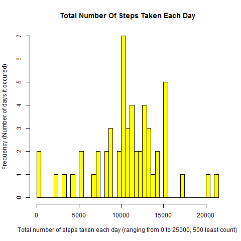
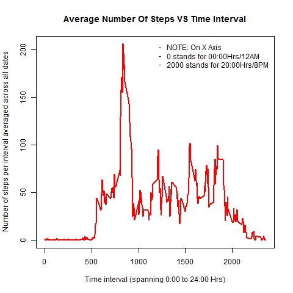
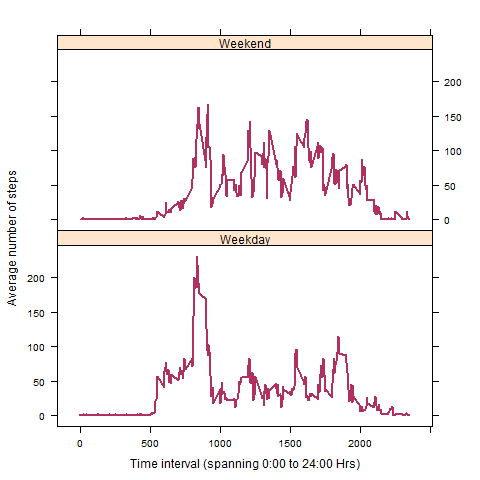

## Loading and preprocessing the data

Load the activity.csv file that has been unzipped to the 'activity' folder in the default directory


```{r, echo=T}
activity_csv <- read.csv("./activity/activity.csv", header=T, sep=",")
```

Check the column value types

```{r, echo=T}
str(activity_csv)
```

Convert column 'date' to type date

```{r, echo=T}
activity_csv$date <- as.Date(activity_csv$date)
```


## What is mean total number of steps taken per day?


1. Calculate the total number of steps taken per day

To do this first total the 'steps' by 'date' for each date of activity that was logged.

Use the 'aggregate' function to get a table of steps taken, summed up for each date and listed as separate rows. Omit the NA values.

```{r, echo=T}
sum_steps_per_day_foreach_date <- aggregate(steps ~ date, activity_csv, sum, na.action = na.omit)
head(sum_steps_per_day_foreach_date,10)
```


2. Make a histogram of the total number of steps taken each day

```{r, echo=T}
#Plot the histogram of total number of steps taken per day for each date
png(file = "histsteps.png")
hist(sum_steps_per_day_foreach_date$steps,col="yellow", breaks=50,main="Total Number Of Steps Taken Each Day", xlab="Total number of steps taken each day (ranging from 0 to 25000, 500 least count)", ylab="Frequency (Number of days it occured)")
dev.off()
```

 


3. Calculate and report the mean and median of the total number of steps taken per day

```{r, echo=T}
#Calculating mean of total number of steps taken per day for each date
mean(sum_steps_per_day_foreach_date$steps)
```


```{r, echo=T}
#Calculating median of total number of steps taken per day for each date
median(sum_steps_per_day_foreach_date$steps)
```


## What is the average daily activity pattern?

Create a table listing the number of steps by each time interval (of five minutes duration) for each day, averaged across all of the dates that the activity was logged

```{r, echo=T}
numstepsperintervalforeachday_avgdacrossalldates <- aggregate(steps ~ interval, activity_csv, mean, na.action = na.omit)
```

1. Make a time series plot (i.e. type = "l") of the 5-minute interval (x-axis) and the average number of steps taken, averaged across all days (y-axis)

```{r, echo=T}
png(file = "timeseries1.png")
with(numstepsperintervalforeachday_avgdacrossalldates, plot(interval, steps, type = "l", lwd = 2, 
        xlab = "Time interval (spanning 0:00 to 24:00 Hrs)", ylab = "Number of steps per interval averaged across all dates", 
        main = "Average Number Of Steps VS Time Interval",
        col = "red"))
legend("topright", box.lty=0,inset=0.01, pch = "-", col=c("red","black","black"),legend=c("NOTE: On X Axis","0 stands for 00:00Hrs/12AM","2000 stands for 20:00Hrs/8PM"))

dev.off()
```

 


2. Which 5-minute interval, on average across all the days in the dataset, contains the maximum number of steps?

```{r, echo=T}
#Get the row number which has the max number of steps on average
row_num <- which.max(numstepsperintervalforeachday_avgdacrossalldates$steps)
#This is the time interval at which the max steps on average occur
row_num
#Use that to get the time (hrs) at which this occurs from the 'interval' column
numstepsperintervalforeachday_avgdacrossalldates[row_num, "interval"]
#On average maximum steps occur at the 104th five minute interval on any given day. Which commences at 8:35 hrs and ends at 8:40 hrs
```


## Imputing missing values

1. Calculate and report the total number of missing values in the dataset (i.e. the total number of rows with NAs)

```{r, echo=T}
sum(is.na(activity_csv))
```


2. Devise a strategy for filling in all of the missing values in the dataset. The strategy does not need to be sophisticated. For example, you could use the mean/median for that day, or the mean for that 5-minute interval, etc.

Use the mean value of steps for each time interval across all dates to substitute in the data set where the 'steps' column value is 'NA'.


3. Create a new dataset that is equal to the original dataset but with the missing data filled in.


```{r, echo=T}
activity_csv_NA_replaced <- activity_csv

for (rnum in 1:nrow(activity_csv)) {
        # Check each row by its row number(rnum) contains an 'NA' value for the column 'steps' 
        if(is.na(activity_csv[rnum,"steps"])) {
                # Get the value of the time interval from the 'interval' column for the same row
                time_interval <- activity_csv[rnum,"interval"]
                # Use the time interval and get the its match by row from the table we already have built for steps averaged by time interval
                # Then get the row number (index) of the matched row
                row_index <- which(time_interval == numstepsperintervalforeachday_avgdacrossalldates[,"interval"])
                # Use that to get the value of the average steps from the 'steps' column for the same row
                avg_steps_val <- numstepsperintervalforeachday_avgdacrossalldates[row_index , "steps"]
                # Go to the corresponding row in the new data set where the 'NA' was located and replace the value of 'NA' with this averaged steps value
                activity_csv_NA_replaced[rnum,"steps"] <- avg_steps_val
        }
}

# Verify that the new data set has no NA values at all
sum(is.na(activity_csv_NA_replaced))
```


4. Make a histogram of the total number of steps taken each day and Calculate and report the mean and median total number of steps taken per day. Do these values differ from the estimates from the first part of the assignment? What is the impact of imputing missing data on the estimates of the total daily number of steps?

```{r, echo=T}
sum_steps_per_day_foreach_date_NA_replaced <- aggregate(steps ~ date, activity_csv_NA_replaced, sum, na.action = na.omit)

#Plot the histogram of total number of steps taken per day for each date
png(file = "histsteps_NONA.png")
hist(sum_steps_per_day_foreach_date_NA_replaced$steps,col="green", breaks=50,main="Total Number Of Steps Taken Each Day (NA's replaced)", xlab="Total number of steps taken each day (ranging from 0 to 25000, 500 least count)", ylab="Frequency (Number of days it occured)")
dev.off()
```


```{r, echo=T}
#Calculating mean of total number of steps taken per day for each date

#Value with NA's omitted
mean(sum_steps_per_day_foreach_date$steps)

#Value with NA's replaced by average
mean(sum_steps_per_day_foreach_date_NA_replaced$steps)

```


```{r, echo=T}
#Calculating median of total number of steps taken per day for each date

#Value with NA's omitted
median(sum_steps_per_day_foreach_date$steps)

#Value with NA's replaced by average
median(sum_steps_per_day_foreach_date_NA_replaced$steps)
```

The values for mean are the same but differ for median, and marginally so. Hence the impact of imputing values is observed to be negligible.

## Are there differences in activity patterns between weekdays and weekends?
we first create a new column in the new data set, which indicate whether a day is a weekday or weekend.

Create a table listing the average number of steps for each time interval (of five minutes duration) for week days and weekends, across all of the dates that the activity was logged.

```{r, echo=T}
deep <- activity_csv_NA_replaced
deep$date <- as.Date(deep$date)
#add a new colum that classifys the dates by weekday (Monday through Friday) or weekend (Saturday and Sunday)
deep$day_type <- weekdays(deep$date)

#Re classify the days of the week Monday through Friday as 'Weekday' and the other days - Saturday and Sunday as 'Weekend'
deep<-transform(deep,day_type=ifelse(day_type=="Monday"|day_type=="Tuesday"|day_type=="Wednesday"|day_type=="Thursday"|day_type=="Friday","Weekday","Weekend"))

#Aggregate the number of steps for each time interval by day type of weekday and weekend and apply the mean to it. Retain the weekday weekend column

avg_steps_bytimeinterval_weekdays_weekends_forall_dates <- aggregate(steps ~ interval + day_type, deep, mean)
head(avg_steps_bytimeinterval_weekdays_weekends_forall_dates)

library(lattice)
png(file = "timeseries_weekday_weekend.png")
xyplot(steps ~ interval | day_type, avg_steps_bytimeinterval_weekdays_weekends_forall_dates, layout = c(1, 2),
       col = "maroon", xlab = "Time interval (spanning 0:00 to 24:00 Hrs)", ylab = "Average number of steps", 
       type = "l", lwd = 2)
dev.off()
```



From the above plots we can observe a difference in activity across weekdays and weekends across the dates activity was measured. 

On Weekdays:

Activity on average begins earlier in the day than on weekends. Starting a little after 5:00 AM in the morning, peaks at more than 200 steps at around 8:35 AM (see result above). After which there is a noticeable decline and activity gradually picks up again at around 9:30 AM and averages out between 20 to 100 steps through the remainder of the day until around 7:30 PM after which it continues to decline till midnight.


On Weekends:

Activity on average begins later in the day as compared to weekdays. starting around 8:00 AM peaking to a max of 150 steps at around 9:00 AM. After which it drops and picks up again at around 10:30 AM and averages out higher than on weekdays, between 25 to 150 steps through the remainder of the day until around 9:00 PM. After which it continues to decline till midnight.

